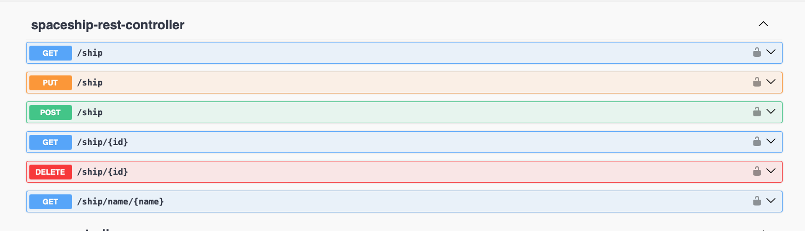

# sify-flix-api

## About this project
* [About](#about)
* [Architecture](#Architecture)
* [Technologies](#Technologies)
* [Swagger Documentation](#Swagger-documentation)
* [Security](#Security)
* [How to run](#how-to-run)
    * [Run with Docker](#run-with-docker-compose)
    * [Run with mvn spring-boot:run](#run-with-mvn-spring-boot)
* [how to run Test](#run-tests)
* [Contributors](#contributors)

# About
This is a Rest API developed based on the requirements given for the selection process by the company W2M.
This API was built with Java 21, Spring Boot, H2 Database, Flyway Migration, Spring Doc OpenAPI, Docker and Docker-compose.

# Architecture
The application is built following the **MVC** design pattern.
Each of the components will be described below:
* **View**: contains response from the Rest controller that will be shown in JSON format to the client.
* **Rest Controller**: responsible for receiving calls and directing them to the correct service.
* **Service**: a design pattern layer responsible for calling the service from the repository layer.
* **Repository**: this layer is responsible for connecting to the database and for persisting, retrieving, updating and deleting data.

# Technologies
- Java 21
- Spring Boot 3.2.2
- Spring Security - Basic Authentication
- Spring OpenAPI
- H2 Database
- Flyway Migration
- Docker
- Docker-compose
- AssertJ, Mockito

# Swagger Documentation

The documentation is generated by Spring Openapi. Once you have started the application the url: ```http://localhost:8080/swagger-ui.html```



# Security
This API is protected with Spring Security using basic authorization.
This API is configured to not save sessions.
Once you have accessed Swagger, simply authenticate with your username and password.
Notes: Basic authorization mode is **not recommended**, as it is not the most secure.
When starting the application, a user with the admin role will already be available:
The is: ```user: admin password:1234```.

# How to Run
There two options to run this application, run by docker-compose or run as spring-boot.

### Run with docker-compose
Make sure you have **Docker** installed and execute the command.

```
docker-compose up
```
### Run with mvn spring-boot
```shell
mvn spring-boot:run
```

# Run tests

This application has unity tests and integration tests, once it use Maven just run:

```
mvn test
```

## Contributors
[@LauroSilveira](https://github.com/LauroSilveira)
